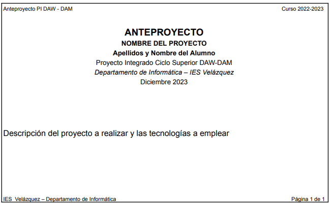

# Proyecto integrado DAW

## 0. Descripción

Proyecto integrado DAW.&#x20;

Planificación temporal - Documentación.&#x20;

Pautas de presentación y entrega.

IES Velázquez - Departamento de informática

Septiembre de 2023

## 1. Introducción

El Departamento permite para los ciclos DAW/DAM dos tipos de proyecto: **“Proyectos de Desarrollo”** y **“Proyectos de Investigación”**.&#x20;

Se considerarán proyectos de desarrollo aquellos en los que se empleen de forma mayoritaria tecnologías vistas a lo largo del ciclo.&#x20;

Por proyectos de investigación se considerarán aquellos en los que se empleen mayoritariamente tecnologías nuevas no vistas en clase, y que el departamento considere de interés suficiente. En este tipo de proyectos el alumno deberá realizar también un desarrollo de una aplicación con los mismos pasos de documentación, pero los requisitos requeridos podrán ser menores al ser implementados con tecnologías no vistas en clase. Los profesores en este tipo de proyectos podrán requerir, si lo estiman conveniente, que el alumno implemente un pequeño tutorial de uso de la tecnología

## 2. Documento de anteproyecto

Al inicio del periodo de proyecto, los alumnos deberán enviar en la tarea del aula virtual dedicada a ello, un breve documento de Anteproyecto donde se explique qué se desea realizar y las tecnologías a emplear. El documento deberá tener el formato que se muestra a continuación:

<figure><figcaption></figcaption></figure>

## 3. Documentación del proyecto

En lugar de tener varios documentos para cada fase del Proyecto, tendremos un único documento llamado “Documentación del Proyecto”, que iremos modificando y creando sucesivas versiones.&#x20;

Deberá usarse alguna **herramienta CASE** de apoyo.&#x20;

Iremos realizando nuevas versiones del documento a medida que vayamos realizando las distintas fases.&#x20;

En este documento tendremos los siguientes apartados:

Portada&#x20;

Lista de Cambios&#x20;

Índice&#x20;

1. Introducción \
   La introducción puede salir de la información mostrada en el Documento de Anteproyecto.
2. Estudio de viabilidad
   1. Descripción del sistema actual
   2. Descripción del Sistema Nuevo
   3. Identificación de Requisitos del Sistema
      1. Requisitos de información \
         Identificar la información que nuestro sistema necesitará almacenar. Para cada requisito de información especificar:&#x20;
         * Descripción.
         * Lista de campos de que consta indicando si son opcionales u obligatorios. Indicar el tipo de datos.&#x20;
         * Volumen de información estimado.&#x20;
         * Otras observaciones&#x20;
      2. Requisitos funcionales. \
         Solo hay que identificar los requisitos funcionales y dar una breve explicación de cada uno. En la fase de análisis se detallarán más en profundidad.&#x20;
      3. Otros Requisitos&#x20;
   4. Descripción de la solución&#x20;
   5. Planificación del proyecto
      1. Equipo de trabajo
      2. Planificación temporal
   6. Estudio del coste del proyecto
3. Análisis del Sistema de Información
   1. Identificación del entorno tecnológico\
      Explicar todo el entorno tecnológico, tanto de desarrollo como de explotación del sistema.&#x20;
   2. Modelado de datos\
      Se parte de los requisitos de información recogidos en el Estudio de Viabilidad.&#x20;
      1. Modelo Entidad-Relación\
         Tanto para bases de datos relacionales como no relacionales se deberá realizar un Diagrama E/R. Se mostrará un volcado gráfico del diagrama realizado con una Herramienta CASE. Se adjuntará también el archivo correspondiente de la Herramienta CASE utilizada.
      2. Esquema de la base de datos\
         En el caso de optar por una base de datos relacional, se adjuntará un archivo sql con el esquema de la base de datos. En el caso de bases de datos no relacionales, especificar el diseño de la misma.&#x20;
      3. &#x20;Datos de prueba Se deberán adjuntar archivos con datos de prueba. Para la generación de datos de prueba se puede usar algún tipo de herramienta de generación de datos aleatorios. Ejemplo: https://www.mockaroo.com/
   3. Identificación de los usuarios participantes y finales\
      Dar una explicación de cada usuario u otro sistema con el que interactúe la aplicación.
   4. Identificación de subsistemas de análisis Dividimos el sistema en partes o subsistemas. Dar una explicación de cada subsistema y mostrar un diagrama de subsistemas en el que se vea cada usuario (u otro sistema) con qué subsistema interactúa.&#x20;
   5. Establecimiento de requisitos \
      Poner un apartado para cada subsistema identificado anteriormente. \
      En cada subsistema, poner un apartado para cada requisito funcional identificado en el EVS (Estudio Viabilidad Sistema). \
      Dar una explicación de cada requisito funcional. Si se considera necesario, adjuntar una especificación del requisito funcional como Caso de Uso.
   6. Diagramas de Análisis \
      Adjuntar los diagramas utilizados en el análisis: diagramas de casos de uso, diagrama de estados, diagramas de secuencia o interacción, diagramas de clases, tablas de decisión, etc. En este caso serán siempre volcados gráficos desde una Herramienta CASE.
   7. Definición de interfaces de usuario&#x20;
      1. Especificación de principios generales de interfaz
      2. Especificación de formatos individuales de la interfaz de pantalla \
         Diseño de cada pantalla. Debe indicarse también el nombre que tendrá y si tiene posibilidad de cambiar de aspecto la pantalla en función del tamaño.. Si se considera adecuado, puede realizarse un diagrama de estados que muestre los distintos estados por los que puede pasar la pantalla.&#x20;
      3. Identificación de perfiles de usuario \
         Perfiles de usuario existentes y especificaciones de la interfaz para cada uno. Debe indicarse para cada perfil a qué pantallas puede acceder.&#x20;
      4. Especificación de formatos de impresión\
         Diseño de los documentos impresos que deba generar el programa.&#x20;
      5. Especificación de la navegabilidad entre pantallas \
         Para cada perfil de usuario, realizar un diagrama que muestre la “navegabilidad” de una pantalla a otra.&#x20;
4. Construcción del Sistema \
   En este apartado debe aparecer cualquier información que se considere de interés relativa a la construcción del sistema.\
   \
   Además, será obligatorio para el desarrollo del proyecto el uso de un repositorio git PRIVADO en Github que contenga todo el código y las fuentes del proyecto. Para ello debes crearte una cuenta personal en la plataforma Github al que deberás añadir como colaboradores a algunos profesores.&#x20;
5. Conclusiones ( otros usos, tareas sin finalizar, problemas encontrados y solventados, que he aprendido….)&#x20;
6. Glosario de términos&#x20;
7. Bibliografía&#x20;
8. Apéndices (Otros documentos que queramos adjuntar a este. Irán en otros archivos)

## 4. Proyectos de investigación

En el caso de que el alumno realice el proyecto con una tecnología nueva y lo suficientemente compleja, el proyecto se considerará de **“investigación”**. Para este tipo de proyectos la complejidad de la aplicación a realizar deberá ser menor que la requerida para aquellos proyectos realizados con tecnologías vistas en clase y/o de poca complejidad (proyectos de **“desarrollo”**).&#x20;

Para esta aplicación "de ejemplo" se deberán también definir los requisitos que se desea que cumpla. Se tiene por tanto que entregar una documentación con los mismos puntos que se piden para proyectos de desarrollo. Lo que puede ocurrir es que a lo mejor algunos o muchos de los requisitos que se planteen implementar inicialmente luego, al ser una tecnología que se está investigando, puede que no se lleguen a poder implementar. Pero es necesario que se realice un trabajo de documentación para plantearse qué se quiere hacer y más o menos cómo hacerlo.&#x20;

En los proyectos de investigación, además de esta documentación de la aplicación, el profesor si lo estima conveniente puede requerir al alumno que se realice también otro documento "tutorial" que explique la tecnología objeto de investigación.

## 5. Seguimiento del proyecto

Todos los alumnos que realizan el Proyecto Integrado tienen la obligación de asistir al aula los días asignados para seguimiento del proyecto. La no asistencia a clase los días de seguimiento puede ocasionar el suspenso del proyecto. A lo largo del periodo de proyecto el alumno deberá entregar las siguientes tareas antes de las fechas indicadas a continuación:&#x20;

* **29 de septiembre**. Documentación de anteproyecto.&#x20;
* **31 de octubre**. Documentación del proyecto hasta el punto 3.6 inclusive (fase de Recogida de requisitos y Análisis). Igualmente deberán entregarse los datos de prueba de la aplicación, preferentemente generados con una herramienta de generación de datos aleatorios.&#x20;
  * En el caso de proyectos de investigación se deberá entregar también lo que se lleve hecho hasta ese momento del tutorial de uso de la tecnología, con respecto a la aplicación planteada.&#x20;
* **A partir del 2 de diciembre**. Entregas y defensas de proyecto. Ya se pondrá la convocatoria oficial en la plataforma Moodle.

## 6. Entrega y presentación del proyecto

Para **proyectos DAW**, en la documentación se deberá especificar todo el proceso de instalación, indicando las versiones de cada componente necesario.&#x20;

Para **proyectos DAM**, en el caso de aplicaciones móviles, se deberá proporcionar el fichero `apk` de instalación para Android. Si fuese necesario una parte servidora se deberá desplegar en una máquina virtual. En la documentación se deberá especificar todo el proceso de instalación, indicando la versión de cada componente necesario. El alumnado deberá entregar, **en la fecha límite** de su exposición, todo el contenido de su proyecto: fuentes (código, imágenes utilizadas, etc…), datos de prueba y documentación. Igualmente, un día antes se podrá asistir a la clase por si necesitan verificar que todo funciona, y/o deberá entregar el `apk` de la aplicación, de forma que el profesorado pueda evaluar su funcionamiento con anterioridad a la presentación. Se deberá tener todo el proyecto preparado para su exposición en el proyector del aula para la hora indicada de inicio de la exposición. **Se recomienda el uso de un ordenador portátil personal.**

## 7. Evaluación del proyecto

La evaluación del proyecto se realizará en base a los siguientes criterios de evaluación:

* **Correcta ejecución de la aplicación en base a los requisitos establecidos**. Este criterio debe ser calificado como `APTO` para poder aprobar el proyecto. Una vez considerado `APTO`, se ponderará con un máximo del 50% de la nota.
* **Entregas solicitadas dentro del plazo**. 20%
* **Documentación**. Este criterio debe ser calificado como `APTO` para poder aprobar el proyecto. Una vez considerado `APTO`, se ponderará con un máximo del 20% de la nota.
* **Defensa del proyecto**. 10%

***
